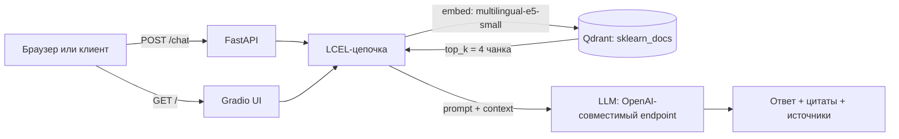

# RAG-сервис: ассистент по документации scikit-learn

Сервис на FastAPI + Gradio, который отвечает на вопросы по документации scikit-learn
(линейные модели, решающие деревья, метрики) на русском и английском языке, опираясь
только на найденные в Qdrant чанки и цитируя источники как `[1]`, `[2]`.

- **Gradio UI:** `GET /` — чат, панель таймингов (retrieval / TTFT / LLM) и панель источников
- **REST:** `POST /chat` — вопрос → ответ + список источников
- **Health-check:** `GET /health`

## Как это работает



1. **Загрузка корпуса** — `app/scripts/load_corpus.py` обходит 10 разделов документации
   scikit-learn (`linear_model`, `tree`, `model_evaluation`, `ensemble`, `cross_validation`,
   `preprocessing`, `compose`, `grid_search`, `impute`, `feature_selection`, `max_depth=1`),
   чистит HTML, добавляет локальные `data/local/*.md` (например, `about.md` — описание самого
   ассистента) и режет всё на чанки по 1000 символов с overlap 200 →
   `data/corpus_chunks.jsonl` (файл генерируется скриптом и в git не хранится).
   В текущей сборке: 11 страниц → 559 чанков.
2. **Индексация** — `app/scripts/index_corpus.py` пересоздаёт коллекцию `sklearn_docs`,
   считает эмбеддинги `intfloat/multilingual-e5-small` (384, косинус), кладёт чанки
   в Qdrant и прогоняет три sanity-запроса (EN / RU / meta-вопрос).
3. **Цепочка** — `app/rag/chain.py`: LCEL `retriever → prompt → LLM → parser`.
   Контекст собирается с нумерацией источников, промпт требует отвечать на языке вопроса
   и не выходить за пределы контекста.
4. **Сервис** — `app/main.py`: FastAPI с `lifespan`-инициализацией цепочки, REST `/chat`
   с обработкой недоступности LLM (503), `/health` и смонтированный на `/` Gradio-чат
   со стримингом ответа.

## Структура

```
app/
  main.py              FastAPI + Gradio UI (стриминг, тайминги, источники)
  llm.py               ChatOpenAI-клиент (OpenAI-совместимый endpoint)
  core/config.py       Settings (pydantic-settings, читает .env)
  rag/chain.py         LCEL-цепочка + retriever
  schemas/chat.py      ChatRequest / ChatResponse / Source
  scripts/             load_corpus.py, index_corpus.py
tests/                 pytest: /health и /chat с замоканной цепочкой
notebooks/             rag_eval.ipynb + rag_metrics.json (RAGAS-оценка)
data/local/            внутренние .md-документы (about this assistant)
docker-compose.yml     app + qdrant
```

## Настройки (`.env`)

| Переменная | Обязательна | Значение по умолчанию |
|---|---|---|
| `LLM_API_KEY` | да | — (без неё сервис падает на валидации `Settings`) |
| `LLM_BASE_URL` | нет | `https://llm.api.cloud.yandex.net/v1` |
| `LLM_MODEL` | нет | `gpt://b1gqeb7j1sefk9u2jehe/yandexgpt-5-lite` |
| `LLM_TEMPERATURE` | нет | `0.0` |
| `LLM_MAX_TOKENS` | нет | `4000` |
| `QDRANT_URL` | нет | `http://qdrant:6333` (локально удобнее `http://localhost:6333`) |
| `COLLECTION_NAME` | нет | `sklearn_docs` |
| `TOP_K` | нет | `4` |
| `EMBEDDING_MODEL` | нет | `intfloat/multilingual-e5-small` |
| `EMBEDDING_DIM` | нет | `384` |
| `NORMALIZE_EMBEDDINGS` | нет | `true` |

### Провайдер LLM

По умолчанию сервис работает через **Yandex AI Studio** (YandexGPT 5 Lite):
`LLM_BASE_URL=https://llm.api.cloud.yandex.net/v1`, `LLM_MODEL=gpt://<folder_id>/yandexgpt-5-lite`,
авторизация — `Authorization: Bearer <LLM_API_KEY>`, где ключ — API-ключ сервисного аккаунта
Yandex Cloud (или IAM-токен). В URI модели `<folder_id>` — идентификатор твоего каталога.

Провайдер задаётся парой переменных, поэтому при необходимости его легко сменить на любой
другой OpenAI-совместимый API — достаточно переопределить `LLM_BASE_URL` и `LLM_MODEL`
в `.env` или в секретах деплоя.

Проверка провайдера без запуска сервиса (тот же путь, что и в приложении):

```bash
python -c "from app.llm import get_llm; print(get_llm().invoke('Ответь одним словом: работает?'))"
```

## Запуск локально

```bash
python -m venv .venv && source .venv/bin/activate    # или conda create -n task-api python=3.11
pip install -r requirements.txt

# 1) Qdrant: поднимаем только векторную БД из compose
docker compose up -d qdrant

# 2) ключ и адрес Qdrant для локального запуска
export LLM_API_KEY=...
export QDRANT_URL=http://localhost:6333

# 3) корпус и индекс (нужно один раз, индекс пересоздаётся с нуля)
python -m app.scripts.load_corpus
python -m app.scripts.index_corpus

# 4) сервис
uvicorn app.main:app --reload
```

Gradio — `http://127.0.0.1:8000/`, Swagger — `http://127.0.0.1:8000/docs`.

## Docker

```bash
docker compose up --build
```

`app` собирается из `Dockerfile` (`python:3.11-slim`, запуск `uvicorn app.main:app`),
том `./qdrant_data` хранит данные Qdrant.

## Тесты

```bash
LLM_API_KEY=test pytest tests/ -v
```

`tests/conftest.py` подставляет тестовый ключ и мокает `build_rag_chain`, поэтому тесты
не обращаются ни к Qdrant, ни к эмбеддеру, ни к LLM.

## Качество ответов

`notebooks/rag_eval.ipynb` — RAGAS-оценка на 18 вопросах (13 EN + 4 RU + 1 meta) по всем
10 разделам корпуса:

| Метрика | Значение |
|---|---|
| recall@4 (retriever) | 1.00 (18/18) |
| faithfulness | 0.88 |
| answer_relevancy | 0.95 |

Сырые замеры — `notebooks/rag_metrics.json` (модель `gpt://<folder_id>/yandexgpt-5-lite`,
эмбеддер `intfloat/multilingual-e5-small`, `top_k = 4`).

Ноутбук удобно прогонять целиком, не открывая Jupyter:

```bash
jupyter nbconvert --to notebook --execute --inplace \
  --ExecutePreprocessor.kernel_name=task-api notebooks/rag_eval.ipynb
```

## Обновление корпуса

`data/corpus_chunks.jsonl` и сама коллекция Qdrant в git не хранятся, поэтому после правки
`SEED_URLS` в `app/scripts/load_corpus.py` или локальных `data/local/*.md` корпус нужно
пересобрать и переиндексировать:

```bash
# локально (Qdrant поднимается через docker compose up -d qdrant)
python -m app.scripts.load_corpus
python -m app.scripts.index_corpus

# на сервере — те же команды внутри контейнера, затем перезапуск приложения,
# чтобы retriever работал с пересозданной коллекцией
docker compose exec -T app python -m app.scripts.load_corpus
docker compose exec -T app python -m app.scripts.index_corpus
docker compose restart app
```

`index_corpus.py` пересоздаёт коллекцию `sklearn_docs` с нуля, поэтому шаг идемпотентен:
повторный запуск даёт то же состояние. Эмбеддер кэшируется в docker-volume `hf_cache`,
так что модель не скачивается заново при каждом прогоне.

## CI/CD

- `.github/workflows/ci.yml` — на pull request и push в `main`: `pytest tests/ -v` и сборка
  Docker-образа.
- `.github/workflows/deploy.yml` — сборка образа в GHCR (`ghcr.io/<owner>/rag-service`)
  и деплой на VPS в `/opt/mentoring/rag-service`: перезапись `.env`, `docker compose pull app`,
  `docker compose up -d app`.
- Секреты репозитория: `LLM_API_KEY` (API-ключ сервисного аккаунта Yandex Cloud), `SERVER_HOST`, `SERVER_USER`, `SSH_PRIVATE_KEY`, `GHCR_TOKEN`.

## Стек

Python 3.11 · FastAPI · Pydantic v2 · LangChain (LCEL) · langchain-qdrant · Qdrant ·
sentence-transformers (`multilingual-e5-small`) · Gradio 5 · RAGAS · pytest · Docker ·
GitHub Actions · GHCR
